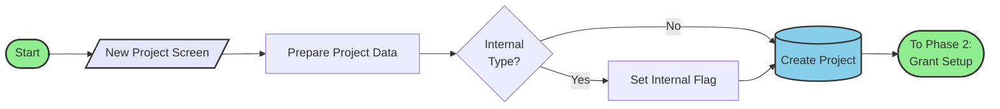
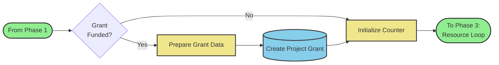
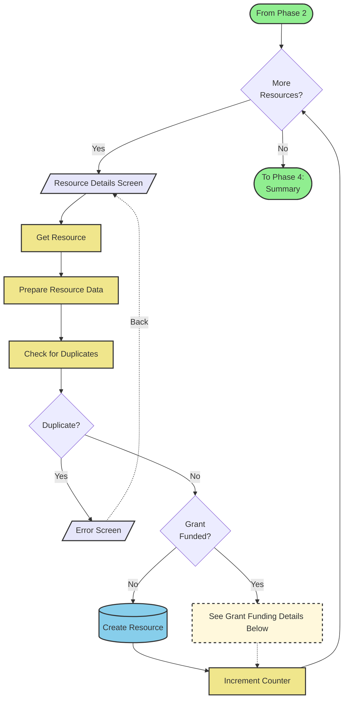
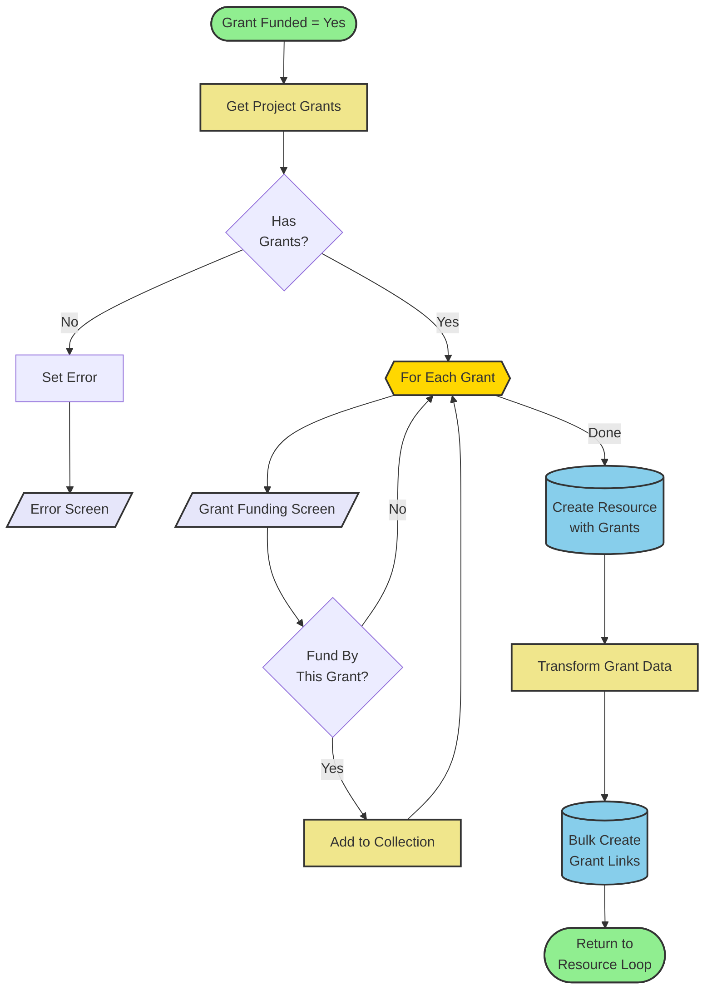
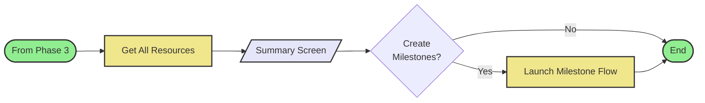

# CreateProject Flow Diagram

## Overview
Comprehensive project creation flow that guides users through creating a new project with optional grant funding and resource assignments.

## Flow Diagrams

### High-Level Overview

### Detailed Flow (by Phase)

#### Phase 1: Project Creation

#### Phase 2: Grant Setup (Optional)

#### Phase 3: Resource Creation Loop

#### Phase 3a: Grant Funding Configuration (Detail)
This section expands the "Grant Funded? → Yes" path from Phase 3.

#### Phase 4: Summary & Completion

## Key Components

### Screens
1. **NewProjectScreen** - Main data entry with 6 sections:
   - Welcome (instructions)
   - Project Information (name, identifier, status, program, account, opportunity, invoice status, project type)
   - Key Dates (kickoff, deadline)
   - Description
   - Budget Information (hours estimate, expense estimate, hourly rate)
   - Grant Configuration (grant selection, adjusted coverage)
   - Resource Creation (checkbox to create resources, number of resources)

2. **ResourceDetailsScreen** - Resource data collection (repeats for each resource)

3. **GrantFundingScreen** - Grant funding configuration (appears for each grant when resource is grant-funded)

4. **SummaryScreen** - Final confirmation with project details and resource table (conditional visibility)

5. **ErrorScreen** - Generic error display with back navigation

### Decision Points
- **IsProjectTypeInternal** - Sets Internal checkbox if type is Internal
- **IsProjectFundedByGrant** - Determines if Project_Grant record should be created
- **MoreResourcesToCreate** - Loop control for resource creation (checks CreateProjectResources checkbox AND counter)
- **CheckForDuplicateProjectResources** - Prevents duplicate resource assignments
- **CheckIfFundedByGrants** - Routes to grant configuration or simple resource creation
- **CheckIfGrantsFound** - Validates grants exist before configuration
- **CheckIfResourceFundedByGrant** - Determines grant associations per resource
- **CheckIfCreateMilestones** - Launches milestone subflow if requested

### Record Operations
- **CreateProject** - Creates MPM4_BASE__Milestone1_Project__c record with estimate fields
- **CreateProjectGrant** - Creates Project_Grant__c junction record
- **CreateProjectResource** - Creates Project_Resource__c (non-grant-funded)
- **CreateProjectResourceWithGrants** - Creates Project_Resource__c (grant-funded)
- **CreateGrantProjectResourcesAfterLoop** - Bulk creates Grant_Project_Resource__c records

### Loops
- **LoopThroughGrants** - Iterates through project grants for resource grant associations

### Error Handling
All record operations have fault connectors that route to ErrorScreen with descriptive messages:
- Project creation failure
- Project grant creation failure
- Resource creation failure
- Grant project resource creation failure
- Duplicate check failure
- Grant lookup failure
- Resource lookup failure
